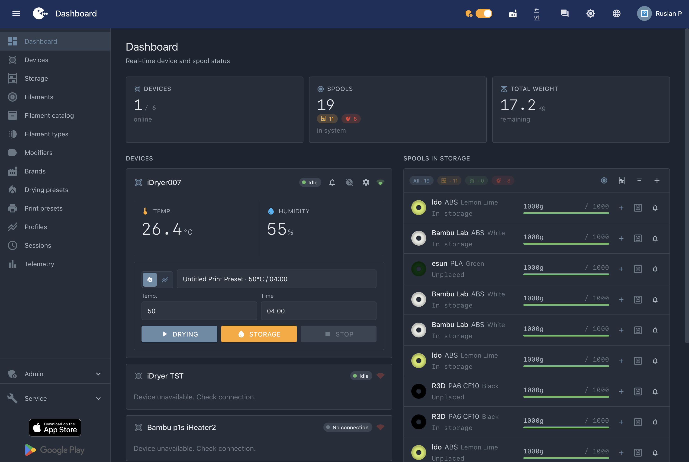
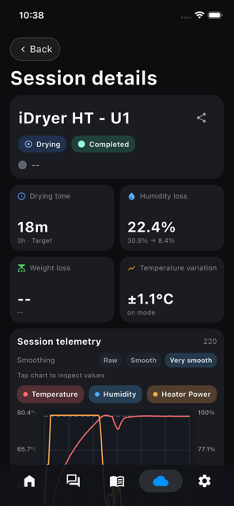

# iDryer Link

**Wi-Fi module for the iDryer filament dryer. Portal, mobile app, over-the-air firmware updates.**

   

---

## What it is

An ESP32 board that connects to the dryer controller through an RJ45 connector and puts the device on your network. Once Wi-Fi is configured, the dryer shows up in the portal and in the mobile app.

> **The RJ45 connector here is not Ethernet.** It carries power and UART. Never connect iDryer Link to a switch or a router.

## What it solves

The dryer controller runs on its own: buttons and a screen on the device itself. iDryer Link gives it a wireless interface, and the dryer stops being a closed box.

Everything else rides on that interface:

- **Telemetry in the portal and the app.** Temperature, humidity, spool weight, live drying state, from anywhere.
- **RFID and a spool database.** The dryer reads the tag, the portal keeps the record: material, remaining grams from the scale, drying history. The data is written back to the tag.
- **Session history.** Every drying run is stored: the curve, how much moisture came out, temperature stability, weight.
- **Over-the-air firmware updates.** For Link itself and for the controller.
- **Integrations with no extra wiring.** Once the dryer is on the network, Klipper reaches it through Moonraker, and so do Home Assistant and Bambu Lab. The dryer knows the printer's state, and the printer knows the dryer's.

## Who it's for

- **You load a spool and the dryer recognizes it.** Tag, weight, a record in the portal. Nothing typed by hand.
- **You know what you have.** Every spool in one database: what is dry, where it sits, how many grams are left. No digging through boxes before a long print.
- **You start drying from your phone.** Pick a preset on the way home and the filament is ready when you arrive. The finish notification comes to you.
- **You print with Klipper.** The dryer appears in Moonraker with no wire to the printer. Klipper sees it, and macros can drive it.
- **You run Home Assistant.** One more device in the house: entities, automations, a dashboard.
- **You want it open.** Schematic, protocol, firmware, all in the repositories. A board for a dollar and a half, flashed from a browser. Want it different? Change it.

## Features

- **Portal and app.** The dryer shows up at [portal.idryer.org](https://portal.idryer.org) and in the mobile app for iOS and Android.
- **Flashing from a browser.** The first flash is done from [install.idryer.org](https://install.idryer.org), with no tools to install. After that, updates arrive over the air.
- **Any ESP32 board.** The firmware builds for any ESP32, with minor modifications in the worst case.

## What it looks like

The portal in a browser: device overview and spool tracking.

 

The mobile app: device list and statistics, the dryer card with presets, a report for a finished session.

  

- [iDryer on the App Store](https://apps.apple.com/app/idryer/id6760609044)
- [iDryer on Google Play](https://play.google.com/store/apps/details?id=org.idryer.mobile)

## Where it fits in the ecosystem

| Layer | What it does | Repository |
|---|---|---|
| Controller | Heating, airflow, sensors, scale, RFID | [iDryerControllerV2](https://github.com/pavluchenkor/iDryerControllerV2) |
| Connectivity | Wi-Fi, portal, app — **this repository** | idryer-link |
| Connectivity with a screen | The same plus a touch display | [iDryer Touch](https://github.com/pavluchenkor/idryer-touch) |
| Protocol | The MQTT and UART contract, shared by all | [idryer-core](https://github.com/pavluchenkor/idryer-core) |
| Cloud | Portal, app, integrations | [portal.idryer.org](https://portal.idryer.org/) |

iDryer Link and iDryer Touch differ only in the screen. The protocol and the connectivity features are the same.

## What you need (BOM)

| Component | Qty | Notes | Where to get it |
|---|---|---|---|
| ESP32-C3 Super Mini board | 1 | ESP32-C3 DevKitM also works | [link](https://es.aliexpress.com/w/wholesale-es32-c3-super-mini.html) |
| Cable with an RJ45 connector | 1 | power and UART, not Ethernet; you build it yourself | [RJ45 pinout](docs/img/RJ45.png), [wiring diagram](docs/img/wiring.png) |
| USB Type-C cable | 1 | for the first flash, any data-capable cable works | — |
| Module case | 1 | 3D printed | [link-case.stp](CAD/link-case.stp) |
| iDryer dryer controller | 1 | running current firmware | [store.idryer.org](https://store.idryer.org/) |

## Difficulty and cost

| | |
|---|---|
| Soldering | required: crimp and solder the RJ45 cable |
| 3D printing | required for the module case |
| Hazardous voltage | no, only 5 V over USB |
| Skills | build a cable from a diagram, flash from a browser |
| Time | about an hour |
| Board cost | ~$1.5 |

## Quick start

1. **Build the RJ45 cable** following the [RJ45 pinout](docs/img/RJ45.png) and the [wiring diagram](docs/img/wiring.png). The connector carries power and UART.
2. **Connect the wires** to the ESP32 board. Pinouts: [ESP32-C3 Super Mini](docs/img/ESP32-C3-Super-Mini-pinout-low.jpg), [ESP32-C3 Zero Waveshare](docs/img/ESP32-C3-ZERO-Waveshare-pinout-low.jpg).
3. **Flash from a browser** at [install.idryer.org](https://install.idryer.org/).
4. **Connect to Wi-Fi** and bind the device at [portal.idryer.org](https://portal.idryer.org/).
5. **Done.** The dryer will appear in the portal and in the app.

Full instructions: [docs/en/README.md](docs/en/README.md) · [Russian guide](docs/ru/README.md) · [docs.idryer.org](https://docs.idryer.org/en/projects/idryer/link/).

## Status

The firmware is in working order: portal and app connectivity, device binding, over-the-air updates, integrations with Home Assistant, Bambu Lab and Moonraker.

It evolves together with the controller firmware: new controller modes show up in the portal as well.

## Boards and protocol

The firmware builds for any ESP32, with minor modifications in the worst case. Ready-made build environments are listed in `platformio.ini`.

The protocol is shared across the ecosystem and defined in `idryer-core` (`contracts/mqtt_contract.yaml`). Changes are made there and propagate to the firmware and the portal through code generation. The protocol is not edited in this repository.

## License

Code: [Apache License 2.0](LICENSE), [NOTICE](NOTICE).

The iDryer name is not covered by the license: [TRADEMARKS.md](https://github.com/pavluchenkor/idryer-core/blob/main/TRADEMARKS.md).

The hardware design is licensed separately.

## Help

- [Telegram](https://t.me/iDryer)
- [Discord](https://discord.gg/jGce5eeHHz)
- [Documentation](https://docs.idryer.org/en/projects/idryer/link/)

Guides and teardowns on the channel: [YouTube](https://www.youtube.com/@iDryerProject) · [Rutube](https://rutube.ru/channel/34401569/)

## Contributing

Built it on a different board, found a mismatch in the diagram, fixed the documentation? Open an issue or send a pull request.

## Next

[Flash the board from your browser](https://install.idryer.org/).
