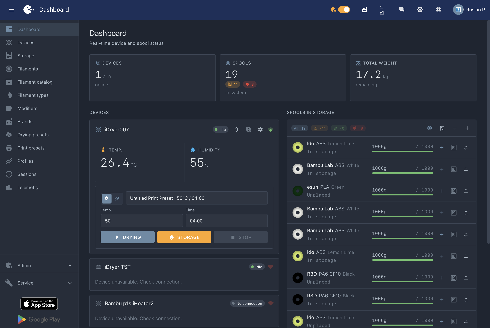
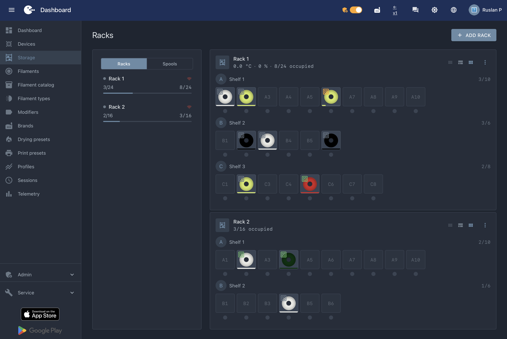

# iDryer Link

**iDryer Link** — модуль связи для сушилки iDryer. Он подключается к контроллеру через RJ45-разъём и выводит устройство в интернет: после настройки Wi-Fi сушилка может работать с порталом iDryer и мобильным приложением.

RJ45 здесь используется как разъём питания и UART. **Это не сетевой порт**: не подключайте Link к коммутатору или роутеру.

## Что даёт Link

- Подключение iDryer к интернету через Wi-Fi.
- Привязку устройства к порталу [portal.idryer.org](https://portal.idryer.org).
- Работу с мобильным приложением iDryer.
- Обновление прошивки через веб-флешер.
- Открытые схемы подключения и CAD-файл корпуса.

## Приложение и портал

- [iDryer в App Store](https://apps.apple.com/app/idryer/id6760609044)
- [iDryer в Google Play](https://play.google.com/store/apps/details?id=org.idryer.mobile)
- [Портал iDryer](https://portal.idryer.org)
- [Веб-флешер](https://install.idryer.org)

## Быстрый старт

1. Соберите кабель RJ45 по [схеме из руководства](docs/README.ru.md#как-подключить-к-контроллеру).
2. Подключите провода к плате ESP32-C3.
3. Прошейте Link через [install.idryer.org](https://install.idryer.org), следуйте инструкции на сайте.

Подробная инструкция: [docs/README.ru.md](docs/README.ru.md)

## Схемы и материалы

- [Русское руководство](docs/README.ru.md)
- [English guide](docs/README.en.md)
- [Схема RJ45](docs/img/RJ45.png)
- [Схема подключения](docs/img/wiring.png)
- [Плата ESP32-C3 Super Mini](docs/img/esp32superMini.png)
- [Пинаут ESP32-C3 Super Mini](docs/img/ESP32-C3-Super-Mini-pinout-low.jpg)
- [Пинаут ESP32-C3 Zero Waveshare](docs/img/ESP32-C3-ZERO-Waveshare-pinout-low.jpg)
- [CAD-файл корпуса](docs/cad/link-case.stp)

## Для разработчиков

Технические материалы перенесены в отдельный раздел:

- [Справка по репозиторию](docs/developer/repository-workflow.md)
- [Post-build scripts](docs/developer/POST_BUILD_SCRIPTS.md)
- [Staging](docs/developer/STAGING.md)
- [Инструменты разработчика](docs/developer/TOOLS.md)
- [Навигация по документации](docs/guide/README.md)
