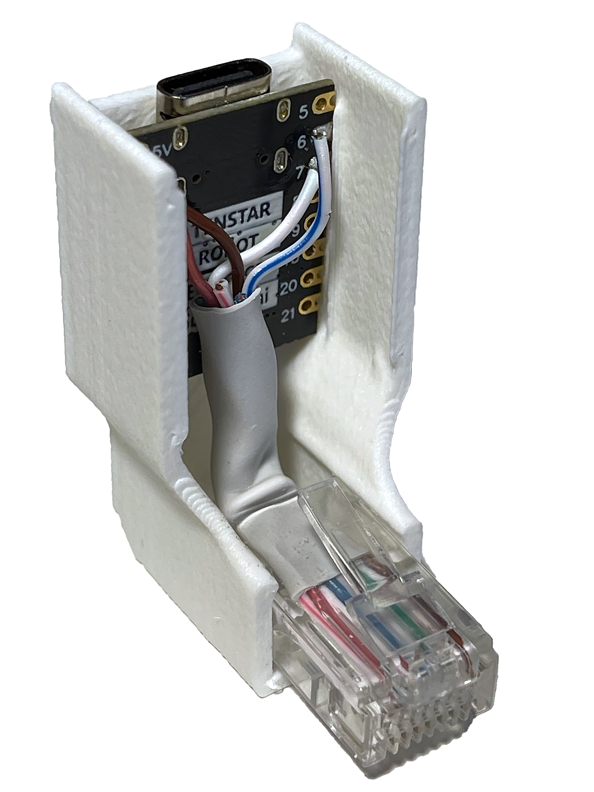
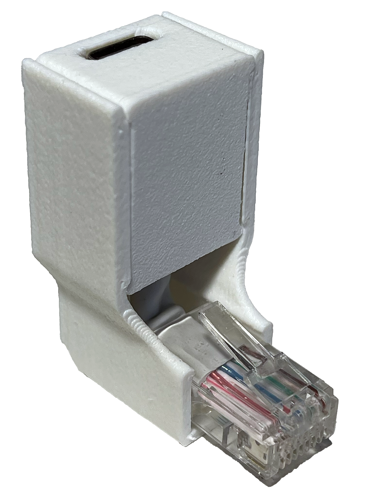
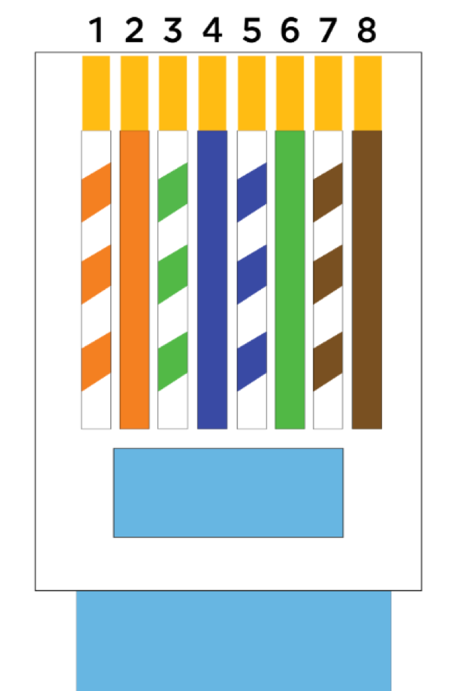
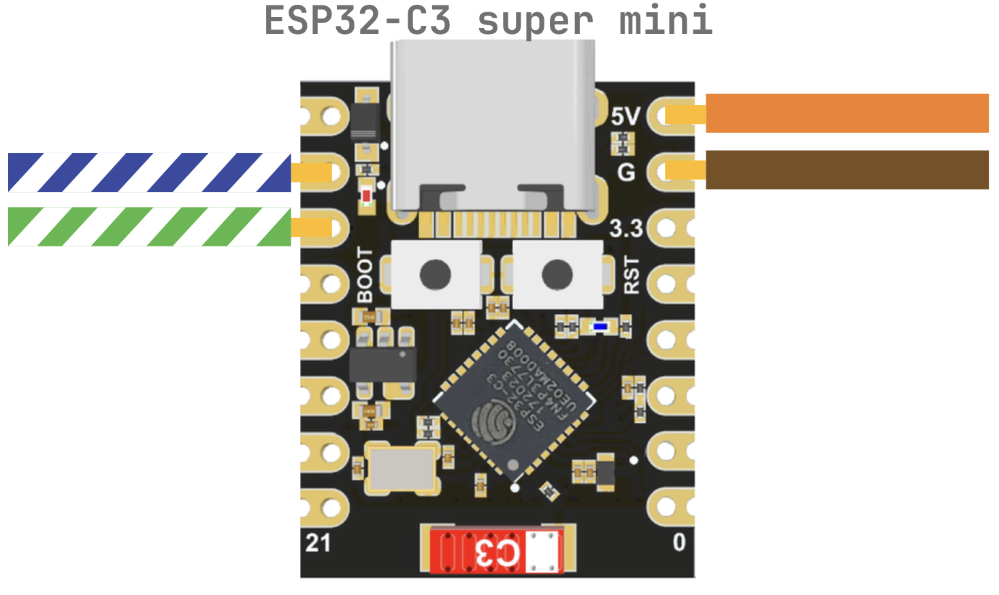
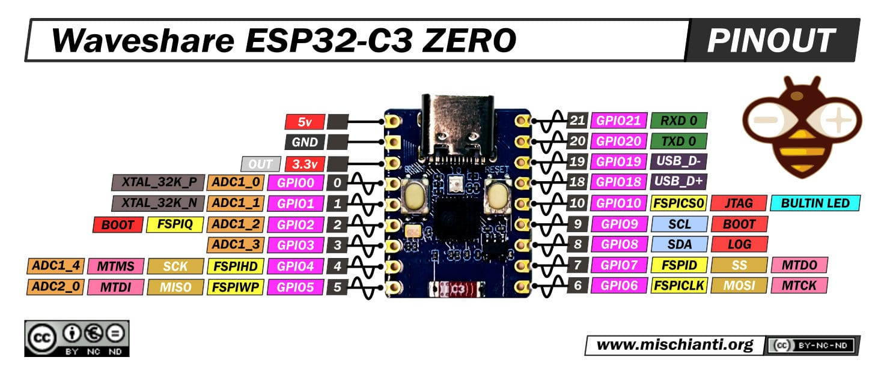
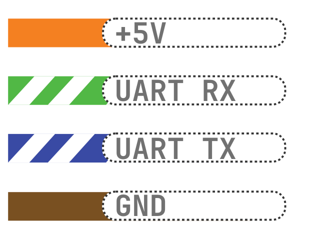

# iDryer Link — quick guide

Link is a connectivity module for iDryer. It plugs into the controller's Ethernet port and communicates with the control board through it (the port is used as a power + UART connector, not as a network interface). Link brings the dryer online and connects it to [portal.idryer.org](https://portal.idryer.org/).




## How to connect to the controller
**Turn off controller power**

**Assemble the RJ45 cable**, following , so the pairs are not mixed up. Important: here RJ45 is just a power/UART connector; do not plug it into a network switch.

**Connect wires** to the ESP32-C3 Super Mini according to 

**Depending on the type and manufacturer of the board, the location of the RX and TX pins may vary**. 
Check the pinout provided by your board vendor.

```
UART_RX_PIN 6
UART_TX_PIN 7
```

**ESP32-C3 Super Mini pinout**


**ESP32-C3 Zero (Waveshare) pinout**



Likewise, by checking the pinout, you can connect any compatible development board.

**Cable pinout**

<!-- 5) Connect Link to the controller's Ethernet port. After power-on, the controller will work with Link as with an external modem. -->

## How to flash via the web flasher
The web flasher is available at https://install.idryer.org/

- Connect Link to a computer USB port.
- Open the [page](https://install.idryer.org/ ) and select **iDryer Link**.
- Select the board:
   - `ESP32-C3 super-mini` — the main option for production modules.
   - `ESP32-C3 DevKit` — if you have a development board.
- Click **Connect**, select the serial port (usually `USB JTAG/serial` or `CH340`). If flashing does not start, hold `BOOT` on the board and briefly press `RST`.
- Click **Install**. The flasher will automatically flash everything required.
- After 100%, the Improv wizard will open: enter Wi-Fi SSID and password, then wait for the "Connected" status.
- If the Improv wizard did not open, disconnect USB and reconnect, selecting **Connect** without reflashing.

## Connecting to the portal

- Click **Start Claim**. A line `PIN:123456` will appear - this is the PIN, valid for ~5 minutes.
- Go to https://portal.idryer.org -> "Add device" -> enter the PIN. After successful linking, the device will appear in the list.
- Disconnect USB and connect Link to the controller via RJ45.
- Power on iDryer
- successful connection will be indicated by a blue "breathing" LED pattern

## Expected result
- The controller sees Link immediately after power-on.
- In the web portal, the device appears online within 1-2 minutes after Wi-Fi connection.
- If status does not appear: recheck pinout using `img/RJ45.png`, crimp quality, correct board selection in the flashing step, and port configuration in the iDryer menu.

## CAD

[Download the case](cad/link-case.stp)
