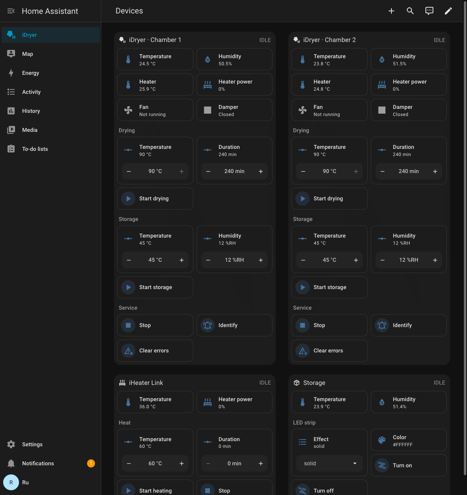
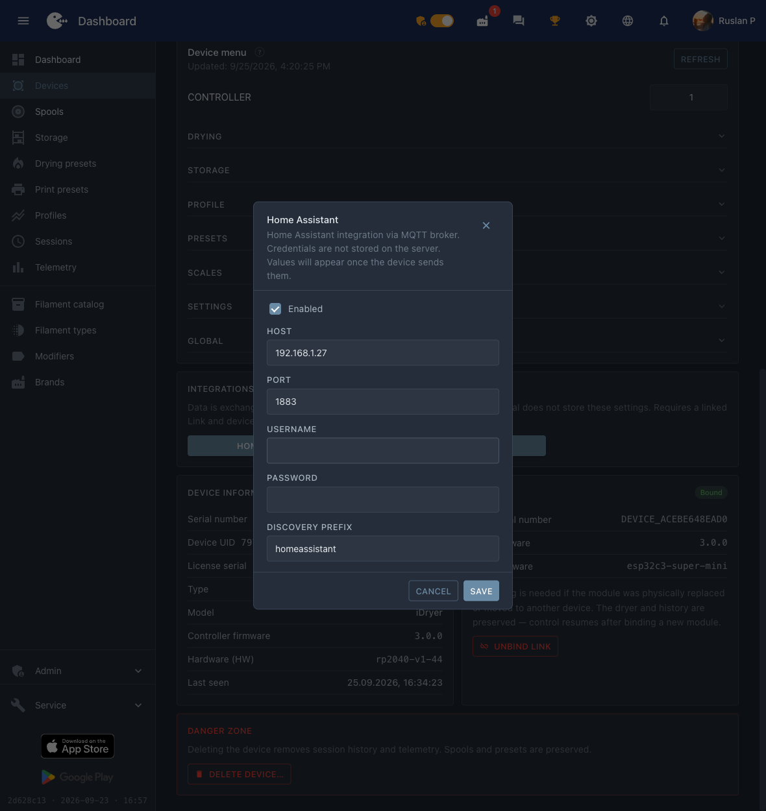

# Home Assistant

A dryer with a Link module publishes itself to Home Assistant via **MQTT Discovery**: HA creates the entities on its own — chamber readings, drying and storage start fields, buttons. The portal is not needed for this, everything goes through your MQTT broker.

Below: enabling the integration, verification and a ready-made card layout, so that the device looks like the picture rather than a list of entities.


*Both dryer chambers on the Home Assistant panel: readings, drying and storage start, service.*

!!! note
    The device **will not appear** in `Settings → Devices & services → Discovered`: this is MQTT Discovery, not UPnP/zeroconf. The **MQTT** integration in Home Assistant must be added in advance.

## What you need

1. An MQTT broker: the **Mosquitto broker** add-on in Home Assistant or any broker on your network.
2. The **MQTT** integration added in Home Assistant, pointing to that broker.
3. A dryer with a Link module on the network and `Online` on the portal.

## Step 1. Enable the integration on the device

Open the device at [portal.idryer.org](https://portal.idryer.org/) and find the **Integrations** → **Home Assistant** block.

| Field | What to enter |
|---|---|
| Host | the broker address on your network, for example `192.168.1.27` |
| Port | the broker port, usually `1883` |
| Username / Password | broker credentials, if it requires them |
| Discovery prefix | `homeassistant`, unless you changed it in the HA settings |
| Enabled | the checkbox — otherwise the device will not connect to the broker |

The settings go straight to the device over the local network — the portal does not store them.


*The broker address, port and the "Enabled" flag — everything the device needs.*

## Step 2. Find the device in Home Assistant

`Settings` → `Devices & services` → the **MQTT** card → in the **Services** section expand the broker node. iDryer devices are listed under serial numbers of the form `DEVICE_*`.


*Devices under the broker node; the dryer shows its entity count.*

Open the device: HA already shows the readings and controls. Check that the values are live — they update together with the device telemetry.

## Step 3. Build the card

HA lays the entities out on its own, and the result is a long list. The ready-made layout groups them the same way as in the app: readings on top, then **Drying**, **Storage** and **Service**.

1. `Settings` → `Dashboards` → **Add dashboard** → an empty dashboard, open it.
2. Top right corner → the pencil (**Edit**) → the "⋮" menu → **Raw configuration editor**.
3. Paste the contents below and save.

The layout is designed for a dashboard of type `sections`.

```yaml
title: iDryer
views:
- title: Devices
  path: devices
  type: sections
  max_columns: 4
  sections:
  - type: grid
    background: true
    cards:
    - type: heading
      heading: iDryer · Chamber 1
      heading_style: title
      icon: mdi:printer-3d-nozzle-heat
      badges:
      - type: entity
        entity: sensor.idryer_u1_mode
        show_icon: false
        show_state: true
        color: primary
    - type: tile
      entity: sensor.idryer_u1_temperature
      name: Temperature
    - type: tile
      entity: sensor.idryer_u1_humidity
      name: Humidity
    - type: tile
      entity: sensor.idryer_u1_heater_temperature
      name: Heater
    - type: tile
      entity: sensor.idryer_u1_heater_power
      name: Heater power
    - type: tile
      entity: binary_sensor.idryer_u1_fan
      name: Fan
    - type: tile
      entity: binary_sensor.idryer_u1_damper
      name: Damper
    - type: tile
      entity: sensor.idryer_u1_weight
      name: Spool weight
      visibility:
      - condition: state
        entity: sensor.idryer_u1_weight
        state_not:
        - unknown
        - unavailable
    - type: heading
      heading: Drying
      heading_style: subtitle
    - type: tile
      entity: number.idryer_u1_drying_temperature
      name: Temperature
      features:
      - type: numeric-input
        style: buttons
      features_position: bottom
    - type: tile
      entity: number.idryer_u1_drying_duration
      name: Duration
      features:
      - type: numeric-input
        style: buttons
      features_position: bottom
    - type: tile
      entity: button.idryer_u1_drying
      name: Start drying
      icon: mdi:play
      hide_state: true
      tap_action: &id001
        action: perform-action
        perform_action: button.press
        target:
          entity_id: button.idryer_u1_drying
      icon_tap_action: *id001
    - type: heading
      heading: Storage
      heading_style: subtitle
    - type: tile
      entity: number.idryer_u1_storage_temperature
      name: Temperature
      features:
      - type: numeric-input
        style: buttons
      features_position: bottom
    - type: tile
      entity: number.idryer_u1_storage_humidity
      name: Humidity
      features:
      - type: numeric-input
        style: buttons
      features_position: bottom
    - type: tile
      entity: button.idryer_u1_storage
      name: Start storage
      icon: mdi:play
      hide_state: true
      tap_action: &id002
        action: perform-action
        perform_action: button.press
        target:
          entity_id: button.idryer_u1_storage
      icon_tap_action: *id002
    - type: heading
      heading: Service
      heading_style: subtitle
    - type: tile
      entity: button.idryer_u1_stop
      name: Stop
      icon: mdi:stop
      hide_state: true
      tap_action: &id003
        action: perform-action
        perform_action: button.press
        target:
          entity_id: button.idryer_u1_stop
      icon_tap_action: *id003
    - type: tile
      entity: button.idryer_u1_identify
      name: Identify
      icon: mdi:bell-ring-outline
      hide_state: true
      tap_action: &id004
        action: perform-action
        perform_action: button.press
        target:
          entity_id: button.idryer_u1_identify
      icon_tap_action: *id004
    - type: tile
      entity: button.idryer_u1_clear_errors
      name: Clear errors
      icon: mdi:alert-remove-outline
      hide_state: true
      tap_action: &id005
        action: perform-action
        perform_action: button.press
        target:
          entity_id: button.idryer_u1_clear_errors
      icon_tap_action: *id005
```


*The same layout in the dashboard configuration editor.*

### The second chamber

On a two-chamber dryer the entities of the second chamber are named the same way, but with `u2`: `sensor.idryer_u2_temperature`, `button.idryer_u2_drying` and so on. Copy the whole `- type: grid` block, paste it after the first one and replace `u1` with `u2` in it, and the heading with `iDryer · Chamber 2`. You get two columns side by side.

## If the entity names do not match

The layout is designed for standard identifiers of the form `sensor.idryer_u1_temperature`. If the card shows "Entity not found", look up your own: `Settings` → `Devices & services` → **MQTT** → your device → the entity list — and replace the prefix in the layout with yours.

## Troubleshooting

| Symptom | What to check |
|---|---|
| The device did not appear in HA | On the portal the Home Assistant integration has the "Enabled" checkbox set, the broker address and port are correct. The device must be `Online`. |
| It appeared, but the values are `Unknown` | Wait for a telemetry cycle. If it is still empty — the broker does not keep retained messages or the device did not connect to it. |
| The buttons do not work | Check that the broker allows publishing to the `idryer/#` topics and that the device log has no authorization errors. |
| Ghost entities with the value `Unknown` | Retained messages from an earlier firmware are left over. Clear them: `mosquitto_pub -h <broker> -t 'homeassistant/<...>/config' -n -r`. |
