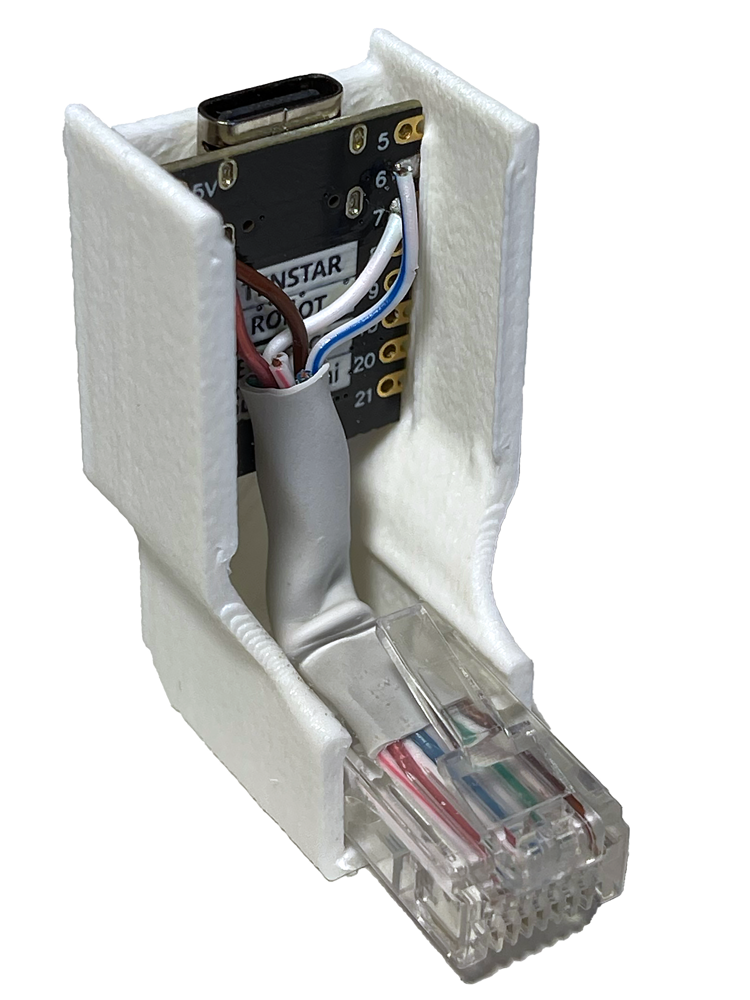
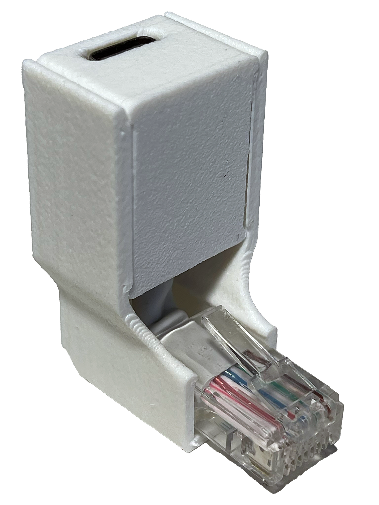
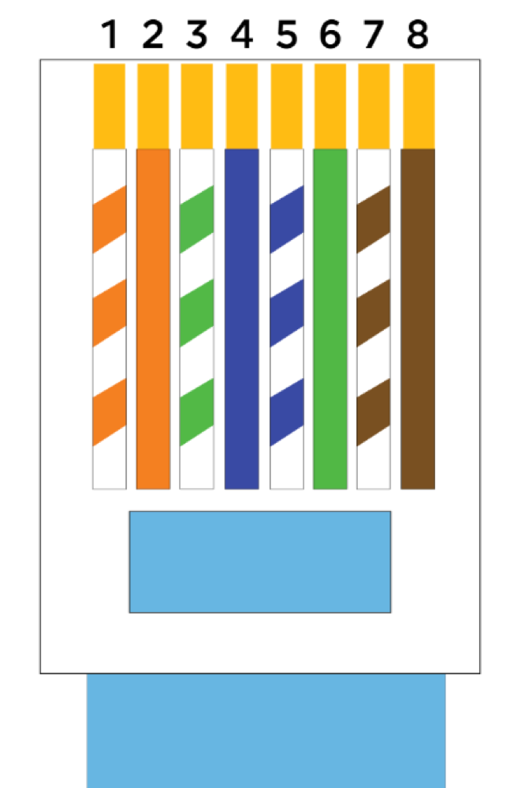
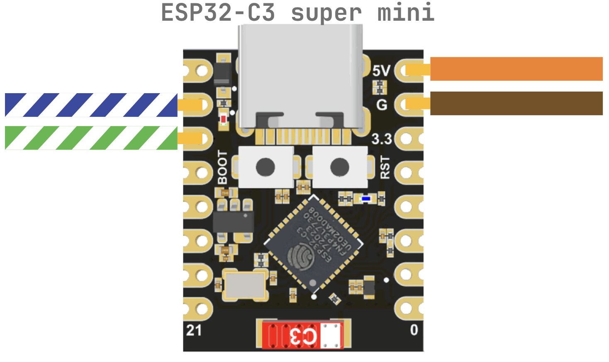
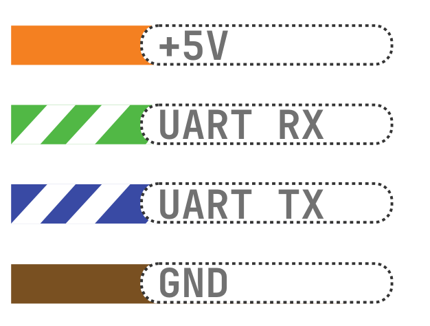

# iDryer Link — guía rápida

Link es un módulo de comunicación para iDryer. Se conecta al puerto Ethernet del controlador y se comunica con la placa de control (el puerto se utiliza como conector de alimentación y UART, no como red). Link conecta el secador a Internet y lo vincula con [portal.idryer.org](https://portal.idryer.org/).




## Cómo conectar al controlador
**Desconecte la alimentación del controlador**

**Arme el cable RJ45**, verifique con

para no confundir los pares. Importante: RJ45 aquí es solo un conector de alimentación/UART, no lo conecte a un conmutador de red.

**Conecte los cables** con ESP32-C3 Super mini según el esquema


**Dependiendo del tipo y fabricante de la placa, la ubicación de los pines 6 y 7 puede variar.**
Verifique en el pinout de su placa proporcionado por el fabricante.

```
UART_RX_PIN 6 (blanco-azul)
UART_TX_PIN 7 (blanco-verde)
```

**Pinout ESP32-C3 super mini**


**Pinout ESP32-C3 Zero (Waveshare)**


De manera similar, verificando con el pinout, puede conectar cualquier placa de desarrollo.


**Conexión del cable**

 
<!-- 5) Podключите Link в Ethernet‑порт контроллера. После включения питания контроллер будет работать с Link как с внешним модемом. -->

## Cómo flashear a través del flasher web
El flasher web está en https://install.idryer.org/

- Conecte Link al puerto USB de su computadora.
- Abra la [página](https://install.idryer.org/) y seleccione el dispositivo **iDryer Link**.
- En, seleccione la placa:
   - `ESP32-C3 super-mini` — opción principal para módulos en serie.
   - `ESP32-C3 DevKit` — si tiene una placa de desarrollo.
- Haga clic en **Connect**, seleccione el puerto serie (generalmente `USB JTAG/serial` o `CH340`). Si el flasheo no inicia, mantenga presionado `BOOT` en la placa y presione brevemente `RST`.
- Haga clic en **Install**. El flasher flasheará todo lo necesario automáticamente.
- Después del 100%, se abrirá el asistente Improv: ingrese el SSID y la contraseña de Wi-Fi, espere el estado "Connected".
- Si el asistente Improv no se abrió, desconecte USB y repita la conexión, seleccionando **Connect** sin volver a flashear.

## Conexión al portal

- Haga clic en el botón **Start Claim**. Aparecerá la línea `PIN:123456` — este es el PIN, válido por ~5 minutos.
- Vaya a https://portal.idryer.org → "Agregar dispositivo" → ingrese el PIN. Después del enlace exitoso, el dispositivo aparecerá en la lista.
- Desconecte USB y conecte Link al controlador mediante RJ45.
- Encienda iDryer
- La indicación LED comunicará una conexión exitosa con una "respiración" azul

## Qué debe obtener
- El controlador ve Link inmediatamente después de aplicar la alimentación.
- En el portal web, el dispositivo aparece en línea dentro de 1–2 minutos después de conectarse a Wi-Fi.
- Si el estado no aparece: verifique nuevamente el pinout según `../../img/RJ45.png`, la calidad de los pares trenzados y la selección correcta de la placa en el paso de flasheo y la configuración de puertos del menú iDryer.

## CAD

[Descargar carcasa](../../CAD/link-case.stp)
