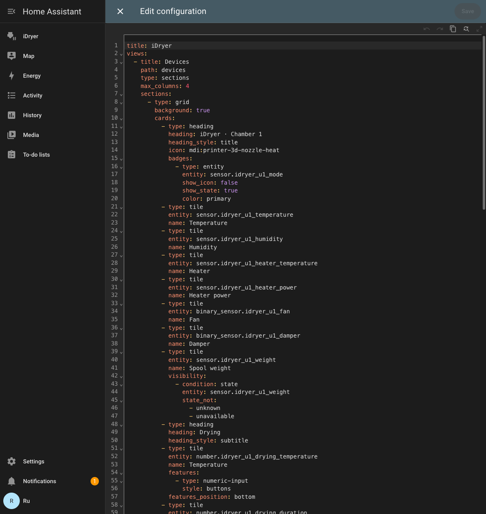

# Home Assistant

El secador con módulo Link se publica en Home Assistant mediante **MQTT Discovery**: HA crea las entidades por sí mismo — lecturas de la cámara, campos de inicio de secado y de almacenamiento, botones. Para esto no hace falta el portal, todo pasa por tu broker MQTT.

A continuación: activación de la integración, comprobación y una disposición de tarjeta lista para usar, para que el dispositivo se vea como en la imagen y no como una lista de entidades.


*Ambas cámaras del secador en el panel de Home Assistant: lecturas, inicio de secado y de almacenamiento, servicio.*

!!! note
    El dispositivo **no aparecerá** en `Settings → Devices & services → Discovered`: esto es MQTT Discovery, no UPnP/zeroconf. La integración **MQTT** en Home Assistant debe estar añadida de antemano.

## Qué se necesita

1. Un broker MQTT: el complemento **Mosquitto broker** en Home Assistant o cualquier broker de tu red.
2. En Home Assistant, la integración **MQTT** añadida y apuntando a ese broker.
3. El secador con módulo Link en la red y `Online` en el portal.

## Paso 1. Activar la integración en el dispositivo

Abre el dispositivo en [portal.idryer.org](https://portal.idryer.org/) y busca el bloque **Integraciones** → **Home Assistant**.

| Campo | Qué escribir |
|---|---|
| Host | dirección del broker en tu red, por ejemplo `192.168.1.27` |
| Port | puerto del broker, normalmente `1883` |
| Username / Password | credenciales del broker, si las requiere |
| Discovery prefix | `homeassistant`, si no lo has cambiado en los ajustes de HA |
| Activado | la casilla — de lo contrario el dispositivo no se conectará al broker |

Los ajustes van directamente al dispositivo por la red local — el portal no los guarda.


*Dirección del broker, puerto y la marca «Activado» — todo lo que el dispositivo necesita.*

## Paso 2. Encontrar el dispositivo en Home Assistant

`Settings` → `Devices & services` → tarjeta **MQTT** → en la sección **Services** despliega el nodo del broker. Los dispositivos iDryer se ven bajo números de serie del tipo `DEVICE_*`.


*Dispositivos bajo el nodo del broker; en el secador se ve el número de entidades.*

Abre el dispositivo: HA ya muestra las lecturas y los elementos de control. Comprueba que los valores estén vivos — se actualizan junto con la telemetría del dispositivo.

## Paso 3. Montar la tarjeta

HA dispone las entidades por su cuenta y sale una lista larga. La disposición lista para usar las agrupa igual que en la aplicación: lecturas arriba, después **Drying**, **Storage** y **Service**.

1. `Settings` → `Dashboards` → **Add dashboard** → un dashboard vacío, ábrelo.
2. Esquina superior derecha → el lápiz (**Edit**) → menú «⋮» → **Raw configuration editor**.
3. Pega el contenido de abajo y guarda.

La disposición está pensada para un dashboard de tipo `sections`.

```yaml
title: iDryer
views:
- title: Devices
  path: devices
  type: sections
  max_columns: 4
  sections:
  - type: grid
    background: true
    cards:
    - type: heading
      heading: iDryer · Chamber 1
      heading_style: title
      icon: mdi:printer-3d-nozzle-heat
      badges:
      - type: entity
        entity: sensor.idryer_u1_mode
        show_icon: false
        show_state: true
        color: primary
    - type: tile
      entity: sensor.idryer_u1_temperature
      name: Temperature
    - type: tile
      entity: sensor.idryer_u1_humidity
      name: Humidity
    - type: tile
      entity: sensor.idryer_u1_heater_temperature
      name: Heater
    - type: tile
      entity: sensor.idryer_u1_heater_power
      name: Heater power
    - type: tile
      entity: binary_sensor.idryer_u1_fan
      name: Fan
    - type: tile
      entity: binary_sensor.idryer_u1_damper
      name: Damper
    - type: tile
      entity: sensor.idryer_u1_weight
      name: Spool weight
      visibility:
      - condition: state
        entity: sensor.idryer_u1_weight
        state_not:
        - unknown
        - unavailable
    - type: heading
      heading: Drying
      heading_style: subtitle
    - type: tile
      entity: number.idryer_u1_drying_temperature
      name: Temperature
      features:
      - type: numeric-input
        style: buttons
      features_position: bottom
    - type: tile
      entity: number.idryer_u1_drying_duration
      name: Duration
      features:
      - type: numeric-input
        style: buttons
      features_position: bottom
    - type: tile
      entity: button.idryer_u1_drying
      name: Start drying
      icon: mdi:play
      hide_state: true
      tap_action: &id001
        action: perform-action
        perform_action: button.press
        target:
          entity_id: button.idryer_u1_drying
      icon_tap_action: *id001
    - type: heading
      heading: Storage
      heading_style: subtitle
    - type: tile
      entity: number.idryer_u1_storage_temperature
      name: Temperature
      features:
      - type: numeric-input
        style: buttons
      features_position: bottom
    - type: tile
      entity: number.idryer_u1_storage_humidity
      name: Humidity
      features:
      - type: numeric-input
        style: buttons
      features_position: bottom
    - type: tile
      entity: button.idryer_u1_storage
      name: Start storage
      icon: mdi:play
      hide_state: true
      tap_action: &id002
        action: perform-action
        perform_action: button.press
        target:
          entity_id: button.idryer_u1_storage
      icon_tap_action: *id002
    - type: heading
      heading: Service
      heading_style: subtitle
    - type: tile
      entity: button.idryer_u1_stop
      name: Stop
      icon: mdi:stop
      hide_state: true
      tap_action: &id003
        action: perform-action
        perform_action: button.press
        target:
          entity_id: button.idryer_u1_stop
      icon_tap_action: *id003
    - type: tile
      entity: button.idryer_u1_identify
      name: Identify
      icon: mdi:bell-ring-outline
      hide_state: true
      tap_action: &id004
        action: perform-action
        perform_action: button.press
        target:
          entity_id: button.idryer_u1_identify
      icon_tap_action: *id004
    - type: tile
      entity: button.idryer_u1_clear_errors
      name: Clear errors
      icon: mdi:alert-remove-outline
      hide_state: true
      tap_action: &id005
        action: perform-action
        perform_action: button.press
        target:
          entity_id: button.idryer_u1_clear_errors
      icon_tap_action: *id005
```


*La misma disposición en el editor de configuración del dashboard.*

### La segunda cámara

En un secador de dos cámaras las entidades de la segunda cámara se llaman igual, pero con `u2`: `sensor.idryer_u2_temperature`, `button.idryer_u2_drying` y así sucesivamente. Copia el bloque `- type: grid` entero, pégalo a continuación del primero y sustituye en él `u1` por `u2`, y el encabezado por `iDryer · Chamber 2`. Quedarán dos columnas una al lado de la otra.

## Si los nombres de las entidades no coinciden

La disposición está pensada para identificadores estándar del tipo `sensor.idryer_u1_temperature`. Si la tarjeta muestra «Entity not found», mira los tuyos: `Settings` → `Devices & services` → **MQTT** → tu dispositivo → lista de entidades, — y sustituye el prefijo de la disposición por el tuyo.

## Diagnóstico

| Síntoma | Qué comprobar |
|---|---|
| El dispositivo no aparece en HA | En el portal, la integración Home Assistant tiene marcada la casilla «Activado» y la dirección y el puerto del broker son correctos. El dispositivo debe estar `Online`. |
| Aparece, pero los valores son `Unknown` | Espera un ciclo de telemetría. Si sigue vacío — el broker no guarda mensajes retained o el dispositivo no se ha conectado a él. |
| Los botones no funcionan | Comprueba que el broker permita la publicación en los tópicos `idryer/#` y que en el registro del dispositivo no haya errores de autorización. |
| Entidades fantasma con valor `Unknown` | Quedan mensajes retained del firmware anterior. Límpialos: `mosquitto_pub -h <broker> -t 'homeassistant/<...>/config' -n -r`. |
